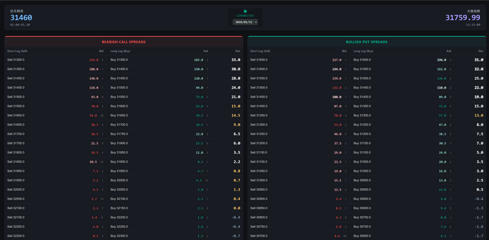

# 📊 Real-Time Option Spread Monitor (台指選價差監控)

這是一個基於 Python 與 FastAPI 的即時選擇權價差監控系統。專為 **Credit Spread (收租策略)** 設計，能夠即時計算並顯示 **Bearish Call Spread (看空價差)** 與 **Bullish Put Spread (看多價差)** 的淨權利金點數。

前端採用現代化的 Dark Mode 儀表板，透過 WebSocket 接收後端 Shioaji API (永豐金) 的即時報價，實現毫秒級的數據更新。


## ✨ 主要功能 (Features)

*   **即時行情監控**：
    *   頂部儀表板顯示 **台指期 (TXF)** 與 **加權指數 (TSE)** 的即時報價與時間。
    *   即時連線狀態指示燈。
*   **價差策略即時試算**：
    *   **Bearish Call Spread (賣權多頭價差)**：監控 `Short Call` vs `Long Call`。 (監控指數-200~+2000)
    *   **Bullish Put Spread (買權空頭價差)**：監控 `Short Put` vs `Long Put`。(監控指數+200~-2000)
    *   自動計算 **Net Credit (淨收點數)**：`Short Bid - Long Ask`。
*   **高效能傳輸**：使用 WebSocket 進行前後端全雙工通訊，僅推播變動數據，降低延遲。
*   **現代化 UI**：
    *   響應式設計 (Grid Layout)。
    *   深色模式 (Dark Mode) 適合長時間看盤。
    *   數據跳動時具備視覺閃爍效果 (紅漲綠跌)。

## 🛠️ 技術棧 (Tech Stack)

*   **Backend**: Python, FastAPI, Uvicorn
*   **Broker API**: [Shioaji](https://github.com/Sinotrade/Shioaji) (Sinopac)
*   **Frontend**: HTML5, CSS3, Vanilla JavaScript
*   **Protocol**: WebSockets
*   **LLM (Gemini 3 Pro) coding part**: Frontend UI, README 

## 🚀 安裝與設定 (Installation)

### 1. 克隆專案 (Clone Repository)
```bash
git clone https://github.com/JasonChou0503/Option_Spread_Monitor.git
cd Option_Spread_Monitor
```

### 2. 安裝相依套件 (Install Dependencies)
#### 本專案使用 uv 管理套件依賴
```bash
uv sync
```

### 3. 設定環境變數 (Configuration)
#### 在專案根目錄建立一個 .env 檔案，填入您的永豐金 API 帳號資訊：
```Ini
# .env file
API_Key=你的API_Key
Secret_Key=你的Secret_Key
```

### 📂 專案結構 (Project Structure)
```text
.
├── main.py          # Python 後端主程式 (FastAPI + Shioaji Logic)
├── index.html       # 前端網頁 (HTML/CSS/JS)
├── .env             # API 金鑰設定檔
└── README.md        # 專案說明文件
```

### ⚠️ 免責聲明 (Disclaimer)
#### 本專案僅供程式交易學習與研究使用，不構成任何投資建議。

* 金融市場存在風險，期貨與選擇權交易可能導致資金損失。
* 作者不保證程式碼的完全正確性或系統的穩定性。
* 使用本程式進行實盤交易前，請務必自行測試並承擔所有風險。

### 🖼️ 成品展示 (DEMO)


Developed by Jason Chou
